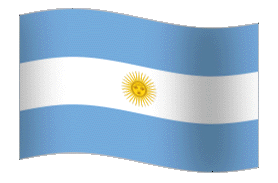

# Mirko Saenz Valiente - Web developer  
[][gmail]
[][twitter]
[][discord]
[][instagram]
[][linkedin]
 
 
Argentinian **Web Developer**. Software engineering student. **Just keep improving**.
### **Ask me about**:
Software development, Visual Studio Code extensions, and videogames. 🕹️ 

## About me
- I'm currently working on [Catalogo Si] , an incredible app that helps people of my city with their purchases and sales administration 🛍️
- Main developer of [Charletto] , have fun answering all type questions with your friends! ⚡😄
- Future Software Engineer, learning everyday. 📚

## Apps and projects
  
### **Catalogo Si**

**Catalogo Si** is an app where anybody can upload and manage their products adjust prices by percentaje and update stock massively. It's mainly destined for SMEs that need a safe and accessible catalogue. 
**Inspired by my family bussiness and the constant inflation of my country.** 
  

  [

][Catalogo si] 

### **Charletto**

The equation is simple; random questions, and funny friends: nothing can go wrong.  

**Charletto** is a quiz game that helps you improve your oral expression.
Its work is simple: after choosing the category, an animation will start and will show you a question that you must ask your friends.

  [

][Charletto]

## **Contact** 
  Feel free to contact me for any reason, via your preffered social media or email.
    
  [][gmail]
[][twitter]
[][discord]
[][instagram]
[][linkedin]
    

[Charletto]: https://charletto.herokuapp.com/
[Catalogo si]: http://catalogosi.herokuapp.com/
[gmail]: mailto:saenzvalientemirko@gmail.com
[twitter]: https://twitter.com/mirkete_
[discord]: https://discordapp.com/users/mirko#0867
[instagram]: https://www.instagram.com/mirkosv_/
[linkedin]: https://www.linkedin.com/in/mirko-saenz-valiente-515673194/
<!--
**mirkete/mirkete** is a ✨ _special_ ✨ repository because its `README.md` (this file) appears on your GitHub profile.

Here are some ideas to get you started:

- 🔭 I’m currently working on ...
- 🌱 I’m currently learning ...
- 👯 I’m looking to collaborate on ...
- 🤔 I’m looking for help with ...
- 💬 Ask me about ...
- 📫 How to reach me: ...
- 😄 Pronouns: ...
- ⚡ Fun fact: ...
